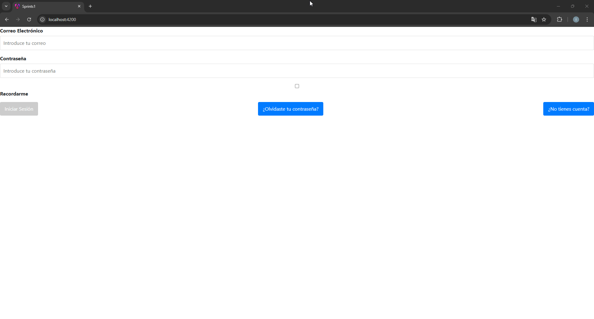
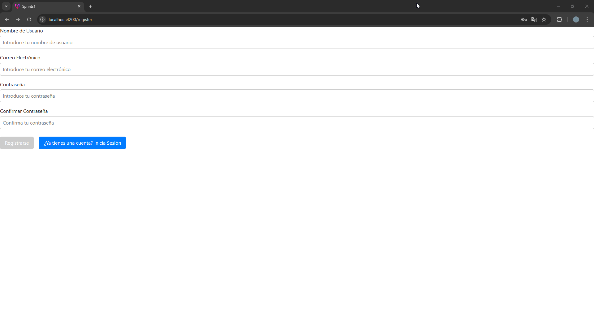
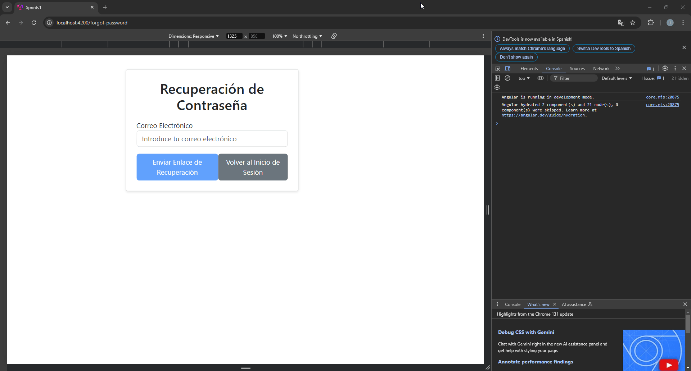

# Sprint 1

## Ejercicio 1: Implementación de la Pantalla de Inicio (Home)

### 🔍 Análisis del Problema

Breve descripción del objetivo: Crear la pantalla de inicio para una red social de metaleros, donde los usuarios puedan explorar conciertos subidos por bandas, ver todas las bandas, destacar bandas recientes y destacadas.

---

### 📋 Diseño de la Propuesta de Solución

#### **Descripción de la Solución**

El diseño incluye una página principal que permite a los usuarios explorar y descubrir contenido relevante sobre conciertos y bandas. Se utilizará un enfoque modular con tecnologías modernas para la interfaz y backend.

#### **Pasos a Seguir**

1. **Diseñar la estructura básica de la Pantalla de Inicio**:
   - Crear un componente principal Home que coordine los subcomponentes.

2. **Implementar la sección de Conciertos**:
   - Mostrar conciertos destacados .
   - Mostrar conciertos recientes.
   - Mostrar todos los conciertos .

3. **Optimizar la experiencia del usuario**:
   - Implementar carga diferida de imágenes y datos.
   - Garantizar que la interfaz sea responsiva y accesible.

---

### 🛠️ Herramientas y Tecnologías Utilizadas

- **Angular**: Para la creación de la interfaz.
- **CSS**: Para diseño responsivo.
- **HTML** Para la estructura
---

### 💡 Consultas Realizadas a ChatGPT

1. ¿Cómo diseñar un carrusel eficiente en Angular?
2. ¿Cuáles son las mejores prácticas para implementar un formulario?
3. ¿Cómo optimizar la carga de imágenes en una aplicación web?

---

### 🧪 Pruebas a Realizar

✅ **Prueba: Comprobación de elementos mínimos y específicos**  
  

---

## Ejercicio 2: Implementación de Módulos de Autenticación (Login, Registro y Recuperación de Contraseña)

### 🔍 Análisis del Problema

Descripción del objetivo: Crear un sistema de autenticación que permita a los usuarios registrarse, iniciar sesión y recuperar su contraseña.

---

### 📋 Diseño de la Propuesta de Solución

#### **Descripción de la Solución**

El sistema de autenticación incluirá formularios para login, registro y recuperación de contraseña, con validaciones avanzadas y manejo de errores.

#### **Pasos a Seguir**

1. **Diseñar el formulario de inicio de sesión**:
   - Validaciones en tiempo real para los campos.

2. **Crear el formulario de registro**:
   - Incluir validaciones para correo electrónico, contraseña y duplicidad de usuario.

3. **Desarrollar el formulario de recuperación de contraseña**:
   - Enviar un enlace al correo del usuario.

---

### 🛠️ Herramientas y Tecnologías Utilizadas

- **Angular**: Para los formularios.

---

### 💡 Consultas Realizadas a ChatGPT

1. ¿Cómo manejar errores de autenticación en Firebase?
2. ¿Qué estrategias usar para validar formularios en React?

---

### 🧪 Pruebas a Realizar

✅ **Prueba 1: Inicio de Sesión Correcto**  
  

❌ **Prueba 2: Error en Inicio de Sesión**  
  

🆕 **Prueba 3: Registro con Validaciones**  
  

🔐 **Prueba 4: Recuperación de Contraseña**  
  

---

## Flujo de Navegación

El siguiente diagrama muestra el flujo de navegación principal de la aplicación:

## Estructura de Carpetas Completa con Categorización

src/
├── app/
│   ├── components/
│   │   ├── auth/
│   │   │   ├── forgot-password/
│   │   │   ├── login/
│   │   │   └── register/
│   │   │       ├── register.component.css
│   │   │       ├── register.component.html
│   │   │       └── register.component.ts
│   │   ├── bands/
│   │   │   └── slider/ CORRESPONDE HA HEROSECTION
│   │   ├── concerts/
│   │   │   ├── concerts-card/
│   │   │   ├── concerts-list/
│   │   │   ├── concerts-page/
│   │   │   └── formnewconcert/
│   │   ├── home/
│   │   │   ├── home-page/
│   │   │   └── newpostbutton/
│   │   ├── layout/
│   │   │   ├── footer/
│   │   │   └── navbar/
│   │   ├── main/
│   │   │   ├── main.component.css
│   │   │   ├── main.component.html
│   │   │   └── main.component.ts
│   │   └── users/
│   │       └── profile/
│   │           ├── profile.component.css
│   │           ├── profile.component.html
│   │           └── profile.component.ts
│   ├── services/
│   │   ├── auth.service.ts
│   │   └── concerts.service.ts
│   ├── shared/
│   │   └── guards/
│   │       └── auth.guard.ts
