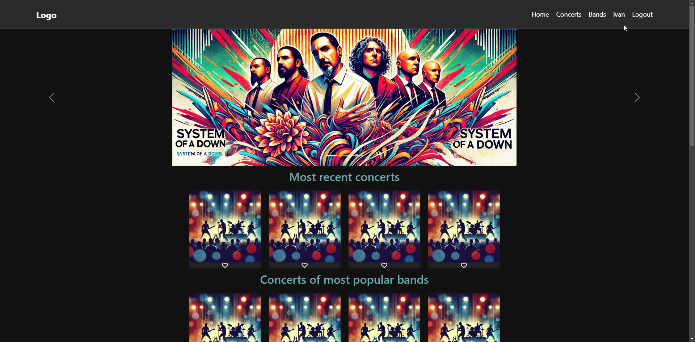
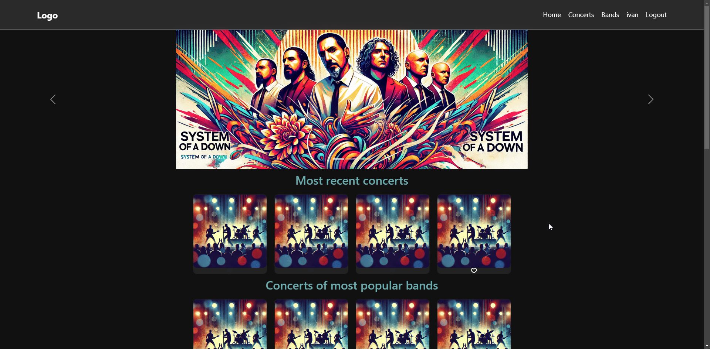
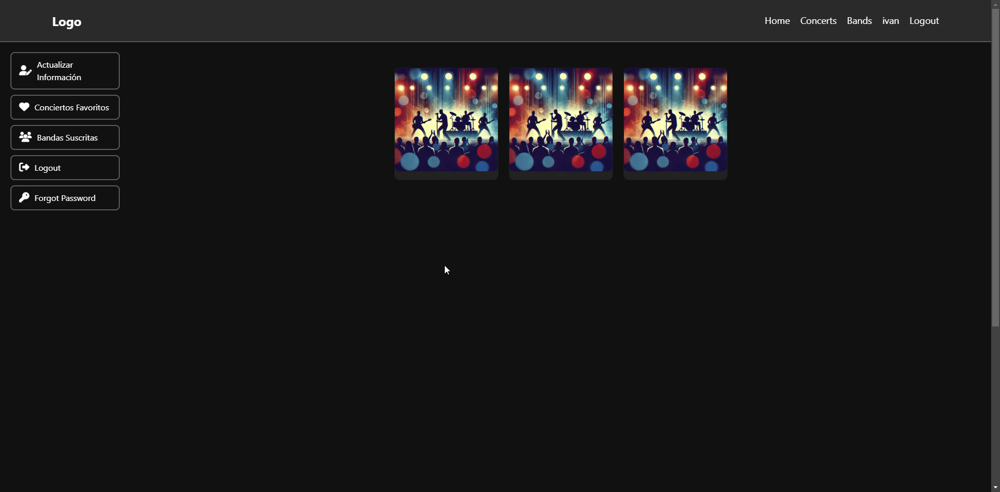
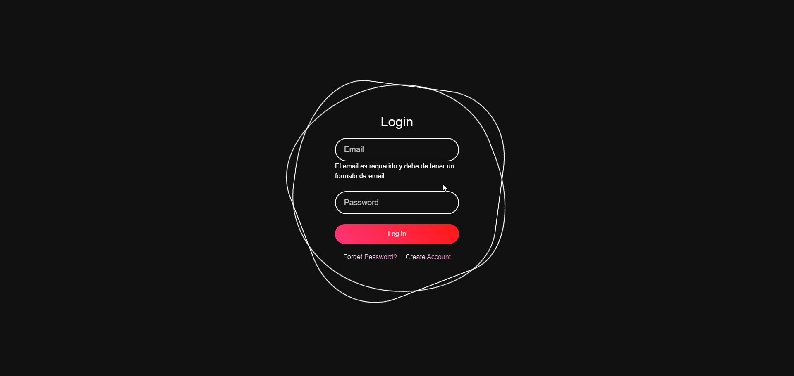
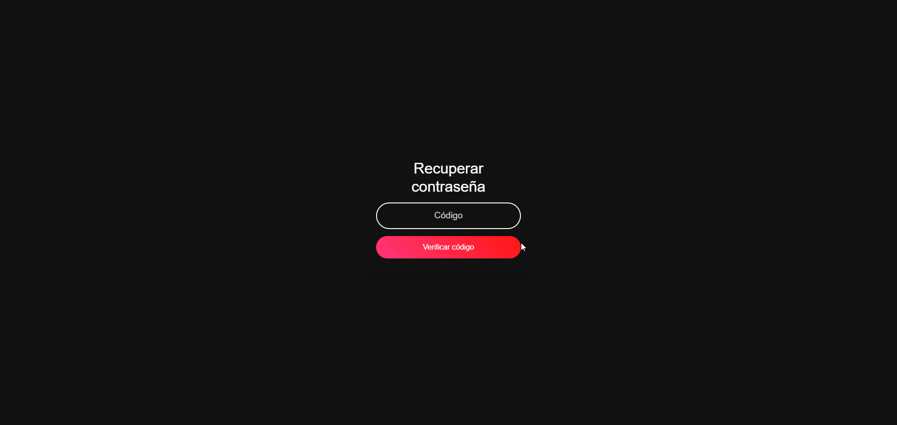

# Documentación de Funcionalidades - MetalSouls

## 1️⃣ Historia de Usuario: Perfil de Usuario

### ✏️ Título: Ver perfil de usuario
**📝 Descripción:** Como usuario registrado, quiero poder ver mi perfil con mi nombre y correo electrónico para confirmar mis datos.

### 📊 Criterios de Aceptación:

1. **Dado que** el usuario está autenticado, **cuando** haga clic en su nombre de cuenta en la navbar, **entonces** el sistema deberá redirigirlo a la vista de su perfil donde podrá ver su información básica.

2. **Dado que** el usuario ha iniciado sesión correctamente, **cuando** se cargue la navbar, **entonces** deberá mostrarse su nombre de cuenta en lugar de una opción genérica.

3. **Dado que** el usuario no ha iniciado sesión, **cuando** se cargue la navbar, **entonces** no deberá mostrarse la opción de perfil y en su lugar deberá aparecer la opción "Sign In".

### 🎨 Diseño:
- Un componente llamado **ProfileComponent** que mostrará el nombre y correo del usuario.
- Integración con el backend para obtener los datos del usuario.

### 🛠️ Implementación:
- Crear el componente `profile.component.ts`.
- Integración con el servicio de usuarios para obtener los datos.
- Agregar un botón en la navbar para acceder al perfil.

### 🔍 Pruebas:
1. **Redirección al perfil:**  
  

2. **Nombre en la navbar:**  
  

3. **Opción "Sign In" en navbar:**  
  

---

## 2️⃣ Historia de Usuario: Favoritos

### ✏️ Título: Guardar conciertos como favoritos
**📝 Descripción:** Como usuario registrado, quiero poder agregar conciertos a una lista de favoritos para acceder a ellos rápidamente desde mi perfil.

### 📊 Criterios de Aceptación:
1. Dado que el usuario está viendo un concierto, cuando presione el botón de "Añadir a favoritos", entonces el sistema deberá guardarlo en la base de datos.
2. Dado que el usuario tiene conciertos en favoritos, cuando acceda a la sección de perfil y haga clic en "Ver favoritos", entonces deberá visualizar la lista de conciertos almacenados.
3. Dado que el usuario puede gestionar sus favoritos, cuando haga clic en el botón "Eliminar de favoritos" en un concierto guardado, entonces el sistema deberá eliminarlo de la lista.

### 🎨 Diseño:
- Botón "❤️" en las tarjetas de concierto.
- Sección en el perfil con los conciertos favoritos.

### 🛠️ Implementación:
- Agregar funcionalidad en `concerts.service.ts` para almacenar favoritos en la base de datos.
- Crear un botón en `concert-card.component.ts` que llame a la función de favoritos.
- Mostrar la lista de favoritos en el perfil del usuario.

### 🔍 Pruebas:
1. **Agregar concierto:** 
  
2. **Eliminar concierto:** 
  
3. **Visualización de favoritos:** 
  

---

## 3️⃣ Historia de Usuario: Recuperar Contraseña

### ✏️ Título: Restablecer contraseña mediante código de verificación
**📝 Descripción:** Como usuario registrado, quiero poder recuperar mi contraseña en caso de olvido mediante un código de verificación enviado a mi correo.

### 📊 Criterios de Aceptación:
1. Dado que un usuario olvidó su contraseña, cuando ingrese su correo en el formulario de recuperación, entonces el sistema deberá enviar un código de verificación a su bandeja de entrada.
2. Dado que el usuario ha recibido el código, cuando lo introduzca en el formulario de verificación, entonces el sistema deberá validar su autenticidad y permitirle avanzar al cambio de contraseña.
3. Dado que el usuario necesita una nueva contraseña, cuando introduzca y confirme su nueva clave, entonces el sistema deberá actualizar su contraseña y permitirle iniciar sesión nuevamente.

### 🎨 Diseño:
- Un formulario donde el usuario ingresa su correo y recibe un código de verificación.
- Una formulario donde el usuario ingresa el código.
- Una formulario donde el usuario ingresa la nueva contraseña y su confirmacion de contraseña.

### 🛠️ Implementación:
- Crear un endpoint en el backend para generar y enviar códigos de verificación.
- Crear los componentes `forgot-password.component.ts` y `reset-password.component.ts`.
- Integrar validaciones para asegurar una contraseña segura.

### 🔍 Pruebas:
1. **Envío de código:** 
  
2. **Código correcto:** 
  
3. **Cambio de contraseña:** 
  

---

